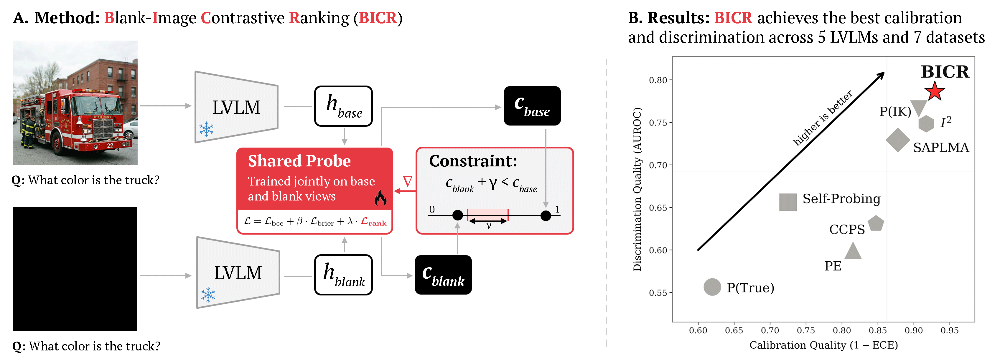

# BICR: Grounded or Guessing? LVLM Confidence Estimation via Blind-Image Contrastive Ranking

Code and bundled benchmark results for the paper:

> Reza Khanmohammadi, Erfan Miahi, Simerjot Kaur, Charese H. Smiley, Ivan Brugere, Kundan Thind, Mohammad M. Ghassemi. *Grounded or Guessing? LVLM Confidence Estimation via Blind-Image Contrastive Ranking.* 2026.
> [arXiv:2605.10893](https://arxiv.org/abs/2605.10893) · Dataset: [Ledengary/VLCB](https://huggingface.co/datasets/Ledengary/VLCB) · License: MIT (code), derivative-research-only (dataset).



Large vision-language models (LVLMs) frequently issue confident-sounding answers that are produced by language priors alone, with no contribution from the supplied image. **BICR** (Blind-Image Contrastive Ranking) trains a single forward-pass confidence probe that penalises this failure mode at training time: for each correct sample, the probe is asked to assign higher confidence to the real-image hidden state than to a paired *blank-image* hidden state, by an Optuna-tuned margin. The blank-image view is consumed only during training; at inference BICR is a standard MLP over one hidden state and carries zero additional cost relative to P(IK).

## Headline result

Pooled cross-VLM average (5 LVLMs × 5 seeds; canonical 1 = correct labels). Values reproduce the paper's Table 2:

| Method            |    ECE ↓ |    BS ↓ |  AUCPR ↑ | AUROC ↑ |
|-------------------|---------:|--------:|---------:|--------:|
| P(True)           |    37.90 |   39.55 |    74.27 |   55.50 |
| Self-Probing      |    26.53 |   29.05 |    78.73 |   65.37 |
| Prompt Ensemble   |    17.23 |   25.27 |    70.82 |   60.23 |
| SAPLMA            |    11.97 |   21.16 |    81.95 |   73.06 |
| P(IK)             |     9.01 |   19.27 |    86.54 |   76.72 |
| InternalInspector |     8.09 |   19.76 |    84.52 |   74.90 |
| CCPS              |    14.91 |   26.93 |    73.43 |   63.39 |
| **BICR**          | **7.08** | **18.37** | **87.64** | **78.68** |

These numbers regenerate via `evaluation/reproduce_paper.ipynb` (or `python -m evaluation.analysis.build_paper_tables`) from the bundled `results/SPARROW/` JSONs. No GPU is required. For trained methods (PIK, SAPLMA, II, CCPS, BICR) the pipeline reproduces the paper to within 0.5 pp on every cell; for prompt-based methods (P(True), Self-Probing, PE) it reproduces to within 1.5 pp — the residual gap there comes from the paper's per-(VLM, method) sample-intersection filter, which is not part of the public pipeline.

## Repository contents

```
.
├── data/                              # reconstruction pipeline (no data shipped)
│   ├── reconstruct_vlcb.py            # build VLCB locally from each source distributor
│   ├── join_model_outputs.py          # fetch Ledengary/VLCB and join on hash_id
│   ├── verify_reconstruction.py       # assert paper-published counts exactly
│   └── expected_counts.json           # frozen counts contract
├── preprocessing/
│   ├── datasets/                      # per-source curators with the unified hash_id routine
│   │   ├── _hash.py                   # single MD5 function imported by every curator
│   │   ├── {gqa,pope,gmai_mmbench,mmmu_pro,mme_finance,llava_in_the_wild}.py
│   └── generation_extraction/
│       ├── generate_and_extract.py    # run an LVLM, dump hidden states / logits / attention
│       └── correctness_labeling.py    # gpt-5-mini judge
├── models/                            # the 8 paper methods + BICR ablations
│   ├── BICR/                          # main method + null-image ablation
│   ├── PIK_train.py
│   ├── SAPLMA_train.py
│   ├── II_extraction.py, II_train.py
│   ├── CCPS_feature_extraction.py, CCPS_proj_train.py, CCPS_clf_train.py
│   └── PE_paraphrase_generation.py
├── evaluation/                        # one *_eval.py per method + reproduction notebook
│   ├── PTRUE_eval.py
│   ├── SELF_PROBING_eval.py
│   ├── PE_eval.py
│   ├── PIK_eval.py
│   ├── SAPLMA_eval.py
│   ├── II_eval.py
│   ├── CCPS_eval.py
│   ├── BICR_eval.py
│   ├── reproduce_paper.ipynb          # regenerates every paper table + figure
│   └── analysis/                      # the table / plot building utilities
├── results/SPARROW/                   # bundled per-(method, VLM, seed) test_{results,labels}.json
├── utils/                             # eval helpers, seed control, Optuna search space
└── docs/                              # figures used in the README, generated tables
```

## Installation

The codebase uses three conda environments because no single environment satisfies all LVLM dependencies. Most extraction, training, and evaluation runs use **`vlmce_vllm`**; the **CCPS** two-stage finetuning prefers `vlmce_acc` (Accelerate + DeepSpeed); the **DeepSeek-VL2** model requires `dsvl` (it pulls a vendored library).

```bash
git clone https://github.com/Ledengary/BICR
cd BICR

# Default env: everything except CCPS finetune and DeepSeek-VL2 inference
conda env create -f environment_vlmce_vllm.yml

# Optional: CCPS two-stage finetune
conda env create -f environment_vlmce_acc.yml

# Optional: DeepSeek-VL2 inference
conda env create -f environment_dsvl.yml
```

Single-environment users can `pip install -r requirements.txt` and skip the DeepSeek-VL2 model.

## Reproducing the benchmark

1. **Obtain the source datasets.** Each constituent benchmark is governed by its own license; we cannot redistribute. Download GQA, POPE, GMAI-MMBench, MMMU-Pro, MME-Finance, and LLaVA-in-the-Wild from their official distributors. The per-source curators in `preprocessing/datasets/` pin HF dataset revisions so the encoding is byte-stable.

2. **Reconstruct VLCB locally.** Runs each curator, computes the canonical `hash_id`, and writes train/validation/test arrow shards.
   ```bash
   python data/reconstruct_vlcb.py \
       --data_root data/vlcb \
       --mme_finance_source /path/to/MME-Finance/extraction
   ```

3. **Pull model outputs from HuggingFace and join.** Inner-joins `Ledengary/VLCB` onto your local item table on `hash_id`.
   ```bash
   python data/join_model_outputs.py --data_root data/vlcb
   ```

4. **Verify counts match the paper appendix exactly.** The script refuses to proceed if a single split, source, or per-(model, split) correctness sum diverges from `expected_counts.json`.
   ```bash
   python data/verify_reconstruction.py --data_root data/vlcb
   # ✓ All counts match. VLCB reconstruction is bit-exact.
   ```

## Reproducing the paper tables and figures

The five-seed × five-VLM evaluation outputs are committed under `results/SPARROW/`, so no LVLM inference is required to reproduce the paper's tables.

```bash
# All tables and figures in one shot:
python -m evaluation.analysis.build_paper_tables

# Or step through the notebook:
jupyter nbconvert --execute evaluation/reproduce_paper.ipynb --to notebook --inplace
```

Outputs land in `docs/tables/*.tex` and `docs/figures_generated/*.pdf`.


## Running a method end-to-end

The pipeline for any trainable method has three stages: **(1)** generic extraction (hidden states, logits, attention) once per LVLM; **(2)** method-specific feature extraction (only for II, CCPS, BICR); **(3)** training; **(4)** evaluation. BICR on Qwen3-VL-8B as a worked example:

```bash
# 1. Generic LVLM inference + per-token state dump (writes to data/extraction/raw/)
python preprocessing/generation_extraction/generate_and_extract.py \
    --model_id Qwen/Qwen3-VL-8B-Instruct \
    --gpu_ids 0 --dtype float32 \
    --dataset_path data/vlcb \
    --target_datasets train validation test \
    --output_dir data/extraction/raw

# 2. BICR-specific extraction: base + blank-image hidden states
python models/BICR/BICR_extraction.py \
    --model_id Qwen/Qwen3-VL-8B-Instruct --gpu_ids 0 \
    --dataset_path data/vlcb \
    --target_datasets train validation test \
    --generation_extraction_dir data/extraction/raw \
    --output_dir data/extraction/BICR

# 3. Train (Optuna 50 trials, 5 seeds, BCE + Brier + rank loss)
for seed in 23 42 137 2024 3407; do
    python models/BICR/BICR_train.py --gpu 0 \
        --model-name Qwen/Qwen3-VL-8B-Instruct --seed $seed
done

# 4. Evaluate (writes test_{labels,results}.json under results/SPARROW/BICR/...)
for seed in 23 42 137 2024 3407; do
    python evaluation/BICR_eval.py --gpu 0 \
        --model-name Qwen/Qwen3-VL-8B-Instruct --seed $seed
done
```

Switch `Qwen3-VL-8B-Instruct` for any of `llava-hf/llava-v1.6-vicuna-13b-hf`, `OpenGVLab/InternVL3_5-14B-HF`, `google/gemma-3-27b-it`, or `deepseek-ai/deepseek-vl2` (the last requires the `dsvl` env). Replace `--gpu 0` with the GPU index of an idle card.

## Method specs

Every trainable method uses `BCEWithLogitsLoss` with `pos_weight = n_neg / n_pos`, Adam, batch size 32, max 200 epochs, early stopping (patience 20) on the composite validation score `0.6·AUROC + 0.4·(1 − ECE)`. Labels are fixed: `1 = correct`, `0 = incorrect`.

| Method            | Type            | Input signal                                                        | Architecture                                                    | Paper §  |
|-------------------|-----------------|---------------------------------------------------------------------|-----------------------------------------------------------------|----------|
| P(True)           | prompt          | softmax(A/B logits) on self-evaluation query                        | none                                                            | §A.5     |
| Self-Probing      | prompt          | verbalized 0–100 confidence (regex-parsed)                          | none                                                            | §A.5     |
| Prompt Ensemble   | prompt          | arithmetic mean of 11 geometric-mean sequence likelihoods            | none (10 gpt-5-mini paraphrases)                                | §A.5     |
| P(IK)             | trainable probe | final-layer hidden state at last prompt token                       | MLP (Optuna depth/width), BCE + pos_weight                      | §A.6     |
| SAPLMA            | trainable probe | last-token hidden state of context+response                         | MLP (256, 128, 64), BCE + pos_weight                            | §A.6     |
| InternalInspector | trainable probe | per-layer (activation, attn, ff) state stack                        | ResNet18 + MLP, supervised contrastive + BCE + pos_weight       | §A.6     |
| CCPS              | trainable probe | 75 per-token features from 5-step ε-perturbation trajectories       | Two-stage: contrastive Conv1d encoder, then classifier finetune | §A.6     |
| **BICR**          | trainable probe | final-layer hidden state, plus blank-image view (training only)     | Shared MLP, BCE + β·Brier + λ·rank loss with margin γ          | §A.7     |

The BICR loss has three components:

$$\mathcal{L} = \mathcal{L}_{\mathrm{bce}}(\hat{p}_{\mathrm{base}}, y;\, w_+) + \beta \cdot \mathcal{L}_{\mathrm{brier}}(\hat{p}_{\mathrm{base}}, y) + \lambda \cdot \frac{\sum_i \mathrm{ReLU}\bigl(\gamma - (\hat{p}_{\mathrm{base},i} - \hat{p}_{\mathrm{blank},i})\bigr) \cdot y_i}{\sum_i y_i + \epsilon}.$$

Optuna ranges (paper §A.9): $\beta \in [0, 0.5]$ uniform, $\lambda \in [0.01, 0.3]$ uniform, $\gamma \in [0.05, 0.25]$ uniform, classifier from `{None, 256, 512, (128,64), (256,128), (512,256), (1024,512), (1024,512,256)}` with dropout `{0, 0.1, 0.3, 0.5}`, learning rate log-uniform in `[1e-5, 1e-3]`, weight decay log-uniform in `[1e-6, 1e-3]`.

## Hardware notes

LVLM inference (`generate_and_extract.py`) runs through vLLM on a single H200 in the original experiments; an A100 80GB or H100 is sufficient. Probe training is light (≤ 16 GB per run) and was performed on A100 40GB cards. The DeepSeek-VL2 model runs in half precision due to numerical instabilities in the public weights; all other models run in full precision.

`utils/general.py` enforces deterministic seeding (`torch.backends.cudnn.deterministic = True`), so identical hardware + identical input data produces identical numbers.

## Citation

```bibtex
@misc{BICR,
  title         = {Grounded or Guessing? LVLM Confidence Estimation via Blind-Image Contrastive Ranking},
  author        = {Reza Khanmohammadi and Erfan Miahi and Simerjot Kaur and Charese H. Smiley
                   and Ivan Brugere and Kundan Thind and Mohammad M. Ghassemi},
  year          = {2026},
  eprint        = {2605.10893},
  archivePrefix = {arXiv},
  primaryClass  = {cs.CL},
  url           = {https://arxiv.org/abs/2605.10893}
}
```

## License

Code is released under MIT (see `LICENSE`). The reconstructed VLCB dataset is a derivative work and inherits ShareAlike provisions from its constituent sources (notably GMAI-MMBench, CC BY-NC-SA); it is therefore intended for non-commercial research use only. See [Ledengary/VLCB](https://huggingface.co/datasets/Ledengary/VLCB) for the full license text.
